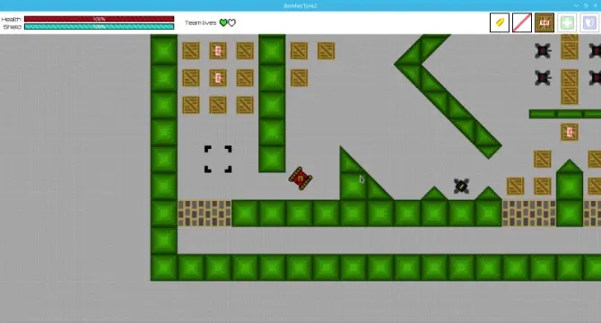
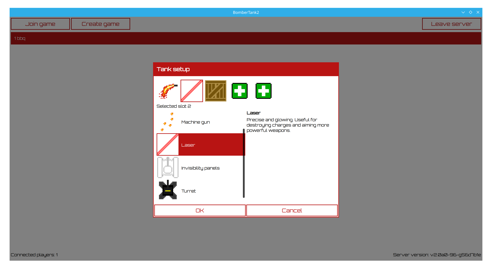
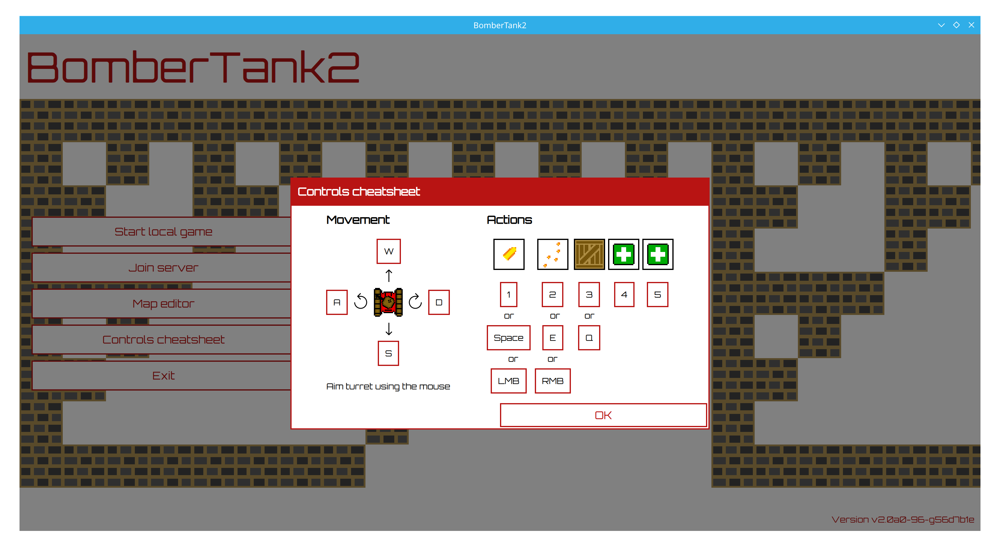

# BomberTank2

A terribly named game involving lots of tanks and not so many bombs



BomberTank2 is a third person shooter involving tanks destroying other tanks.
 - You can equip your tank using a bunch of different weapons and modules
 - Fully networked, with team games supported
 - Integrated map editor

## Installing

### For Mac and Windows

Find the latest commit, go the the GitHub Actions and download the corresponding zip file from the build artefacts.

For Mac, the zip file contains a .dmg file which contains a .app folder which can be run in the same way as any other Mac app.

For Windows, the zip file contains (among other things) `bt_client.exe`, which is the exe you should run to start the game

### For Linux (and other platforms building from source)

Make sure Qt6, box2d and msgpack are installed, then build using CMake:

```
mkdir build
cd build
cmake ..
make -j4
```

CMake may require some flags if you have not installed the dependencies system-wide.

Run the game using `./build/client/bt_client --server-exe ./build/server/bt_server`

## How to start a game

First you need a map. Some good candidates can be downloaded from the `maps` folder of this repository, or you can create one using the map editor.

Next, either join a server or start a local server. Then click create game, select the map, give the game a title and press Ok. Then select the game, click join.



You will then need to select which weapons and modules your tank will have. When you are ready, press Ok and you will join the game, assigned to the team with the fewest players.

Don't forget to check the controls cheatsheet first!


